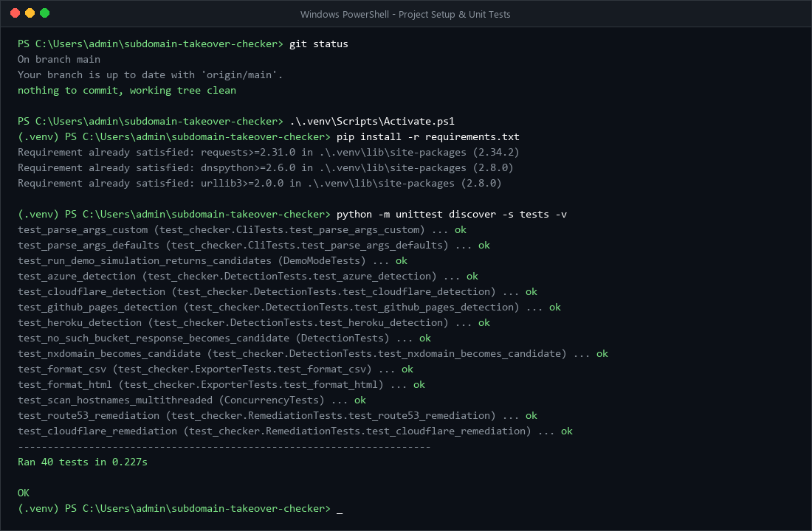
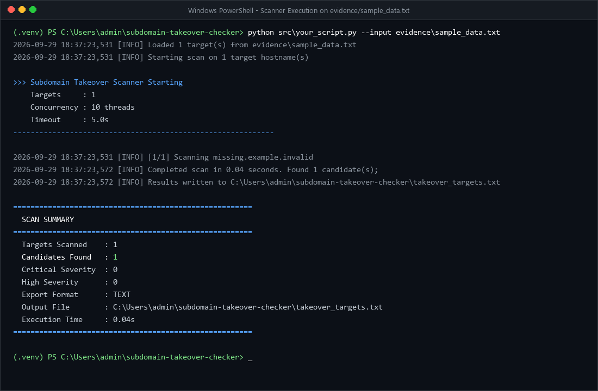
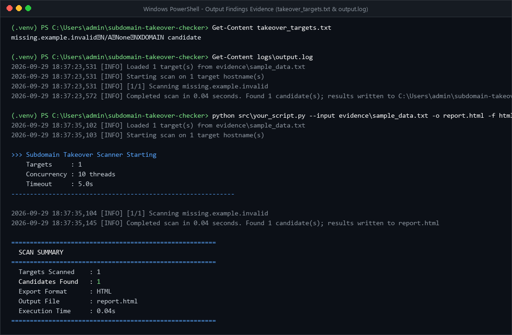

# Rudra Pratap Dalei - Red Team Subdomain Takeover Scanner

[](https://github.com/Rhack-INDIA/subdomain-takeover-checker/actions/workflows/ci.yml)


A high-performance, concurrent Python red-teaming tool designed to scan authorized lists of subdomains and perform automated reconnaissance for takeover-related signals, including:

- **Passive Subdomain Enumeration:** Discovers subdomains directly from public Certificate Transparency logs (`crt.sh`) and OSINT endpoints without requiring API keys.
- **NXDOMAIN Candidates & Dangling CNAMEs:** Identifies unresolved subdomains and canonical name (CNAME) chains pointing to unclaimed third-party resources.
- **Multi-Cloud Fingerprint Signatures:** Inspects HTTP/HTTPS responses across 35+ leading cloud hosting, SaaS, and CDN providers for unclaimed resource error markers.
- **Severity & Confidence Scoring:** Automatic classification into Critical, High, and Medium severity tiers, coupled with contextual remediation playbooks.
- **Interactive Dark-Mode HTML Reports:** Generates responsive, standalone security assessment reports featuring real-time client-side search, severity filtering, and print-to-PDF support.
- **Red Team Proxy & Evading Controls:** Integrated HTTP/SOCKS proxy routing (Burp Suite / Tor), custom header injection, configurable request throttling (`--delay`), and automated retries.
- **Concurrent Multi-Threading:** Rapid scanning of large target inventories utilizing dynamic worker pools.
- **Flexible Multi-Format Reporting:** Export findings to interactive HTML, aligned plain text, RFC 4180 CSV, or structured JSON.
- **Automated CI/CD:** Integrated GitHub Actions workflow running cross-platform tests across Python 3.10 through 3.13.

> [!NOTE]
> These signals are leads, not proof of a takeover. A missing DNS record or matching provider error page must be verified against current DNS configuration and cloud tenant claims before reporting.

---

## Supported Provider Signatures (35+ Providers)

The scanner recognizes fingerprinted response patterns and dangling CNAME targets for:

| Provider | CNAME Indicators | Signature Examples | Severity |
| :--- | :--- | :--- | :--- |
| **AWS S3** | `*.s3.amazonaws.com`, `s3-website` | `NoSuchBucket`, `The specified bucket does not exist` | `CRITICAL` |
| **AWS CloudFront** | `*.cloudfront.net` | `ERROR: The request could not be satisfied` | `HIGH` |
| **GitHub Pages** | `*.github.io` | `There isn't a GitHub Pages site here` | `CRITICAL` |
| **Heroku** | `*.herokuapp.com`, `*.herokussl.com` | `No such app`, `There's nothing here, yet.` | `CRITICAL` |
| **Microsoft Azure** | `*.azurewebsites.net`, `*.cloudapp.net` | `404 Web Site not found`, `The specified account does not exist` | `CRITICAL` |
| **Cloudflare** | `*.cloudflare.net` | `Error 1016: Origin DNS error` | `HIGH` |
| **Netlify** | `*.netlify.app`, `*.netlify.com` | `Not Found - Request ID`, `Page Not Found - Netlify` | `CRITICAL` |
| **Vercel** | `*.vercel.app`, `cname.vercel-dns.com` | `404: NOT_FOUND`, `deployment could not be found on Vercel` | `CRITICAL` |
| **Firebase Hosting** | `*.firebaseapp.com`, `*.web.app` | `Site Not Found`, `Firebase Hosting Setup` | `HIGH` |
| **GitLab Pages** | `*.gitlab.io` | `The page you're looking for could not be found` | `HIGH` |
| **Fly.io** | `*.fly.dev` | `404 Not Found`, `Fly.io 404` | `HIGH` |
| **Render** | `*.onrender.com` | `Not Found`, `This service does not exist` | `HIGH` |
| **Shopify** | `*.myshopify.com` | `Sorry, this shop is currently unavailable` | `HIGH` |
| **Fastly CDN** | `*.fastly.net` | `Fastly error: unknown domain` | `HIGH` |
| **Surge.sh** | `*.surge.sh` | `project not found` | `CRITICAL` |
| **Ghost** | `*.ghost.io` | `The thing you were looking for is no longer here` | `HIGH` |
| **ReadTheDocs** | `*.readthedocs.io` | `is not hosted by Read the Docs` | `HIGH` |
| **Bitbucket** | `*.bitbucket.io` | `Repository not found` | `HIGH` |
| **Zendesk** | `*.zendesk.com` | `Help Center Closed` | `HIGH` |
| **Pantheon** | `*.pantheonsite.io` | `The gods are wise, but do not know of the site which you seek` | `HIGH` |
| **Webflow** | `*.webflow.io` | `The page you are looking for doesn't exist or has been moved` | `HIGH` |
| **HubSpot** | `*.hubspot.net` | `domain has been disabled or not yet been assigned to a portal` | `HIGH` |
| **Statuspage** | `*.statuspage.io` | `domain has not been configured` | `HIGH` |
| **Kinsta** | `*.kinsta.cloud` | `No Site Found` | `HIGH` |
| **Intercom** | `*.custom.intercom.help` | `Uh oh, that page doesn't exist` | `HIGH` |
| **Pingdom** | `stats.pingdom.com` | `Public Report Not Activated` | `MEDIUM` |
| **UserVoice** | `*.uservoice.com` | `This UserVoice instance does not exist!` | `HIGH` |
| **Strikingly** | `*.strikinglydns.com` | `page not found` | `HIGH` |
| **SmartJobBoard** | `*.smartjobboard.com` | `This job board of is currently unavailable` | `HIGH` |
| **Help Scout** | `*.helpscoutdocs.com` | `No settings were found for this company:` | `HIGH` |
| **Tumblr** | `domains.tumblr.com` | `Whatever you were looking for doesn't seem to exist` | `HIGH` |
| **WordPress.com** | `*.wordpress.com` | `Do you want to register`, `doesn't exist` | `HIGH` |
| **Unbounce** | `*.unbouncepages.com` | `The requested URL was not found on this server` | `HIGH` |
| **Helpjuice** | `helpjuice.com` | `We could not find what you're looking for` | `HIGH` |
| **Cargo** | `cargocollective.com` | `404 Not Found` | `HIGH` |

---

## Requirements & Setup

* Python 3.10+
* Dependencies: `requests`, `dnspython`

Clone the repository and install dependencies in a virtual environment:

```powershell
# Clone repo
git clone https://github.com/Rhack-INDIA/subdomain-takeover-checker.git
cd subdomain-takeover-checker

# Set up virtual environment
python -m venv .venv
.\.venv\Scripts\Activate.ps1

# Install requirements
pip install -r requirements.txt
```

---

## Usage

### 1. Passive Reconnaissance & Discovery (No Wordlist Required)
Discover subdomains passively from Certificate Transparency logs and immediately scan them:

```powershell
python src\checker.py -d example.com -o report.html -f html
```

Save discovered subdomains to a separate inventory file for future assessments:

```powershell
python src\checker.py -d example.com --save-subdomains subdomains.txt -o report.html
```

### 2. Scanning Pre-defined Subdomain Inventories
Place target hostnames in a text file (one per line; comments with `#` and blank lines are ignored):

```powershell
python src\checker.py -i evidence\sample_data.txt
```

### 3. Red Team Engagement (Proxy, Headers & Rate Limiting)
Tunnel scans through Burp Suite with custom authorization headers and delay:

```powershell
python src\checker.py -i targets.txt -p http://127.0.0.1:8080 -H "X-Forwarded-For: 127.0.0.1" --delay 0.2 -t 5 -k
```

### 4. Interactive HTML Vulnerability Report
Export an interactive dashboard report:

```powershell
python src\checker.py -i targets.txt -o assessment_report.html -f html
```

### 5. Automated Defensive Remediation Playbooks
Generate automated AWS Route53, Cloudflare, and BIND DNS cleanup scripts for all detected dangling records:

```powershell
python src\checker.py -i targets.txt --fix-script remediation.sh
```

---

## Command-Line Arguments

| Flag | Long Flag | Default | Description |
| :--- | :--- | :--- | :--- |
| `-i` | `--input` | `evidence/sample_data.txt` | Path to target hostname list file. |
| `-d` | `--domain` | `None` | Target root domain for passive discovery via Certificate Transparency (`crt.sh`). |
| | `--save-subdomains` | `None` | Path to save passively discovered subdomains to disk. |
| | `--fix-script` | `None` | Path to export automated defensive DNS remediation playbooks (Route53/Cloudflare/BIND). |
| `-o` | `--output` | `takeover_targets.txt` | Path to save scan findings. |
| `-l` | `--log` | `logs/output.log` | Path for run logs. |
| `-t` | `--threads` | `10` | Number of concurrent worker threads. |
| `-w` | `--timeout` | `5.0` | HTTP and DNS timeout in seconds. |
| `-f` | `--format` | `text` | Export format: `html`, `text`, `json`, `csv`, or `legacy`. |
| `-k` | `--no-verify-ssl` | `False` | Ignore SSL/TLS validation (for dangling custom certs). |
| `-p` | `--proxy` | `None` | HTTP or SOCKS proxy URL (e.g. `http://127.0.0.1:8080`). |
| `-H` | `--header` | `None` | Custom HTTP header (can be specified multiple times). |
| | `--delay` | `0.0` | Delay in seconds between requests for rate limiting. |
| `-r` | `--retries` | `0` | Number of HTTP request retries on network failures. |
| | `--no-color` | `False` | Disable ANSI color codes in terminal output. |
| `-v` | `--verbose` | `False` | Enable detailed debug logging. |

---

## Output Formats

### Interactive HTML Dashboard (`-f html`)
A standalone, zero-dependency, dark-mode cybersecurity report complete with:
- Executive summary metrics (Total targets, Critical/High/Medium breakdown).
- Dynamic client-side search across hostnames, providers, CNAME targets, and reasons.
- Severity button filters (All / Critical / High / Medium).
- Step-by-step remediation advice for each identified service.
- Print-to-PDF optimized stylesheets.

### JSON (`-f json`)
```json
[
  {
    "hostname": "docs.example.com",
    "service": "GitHub Pages",
    "cname": "org.github.io",
    "severity": "CRITICAL",
    "confidence": "CONFIRMED",
    "reason": "GitHub Pages marker (404)",
    "remediation": "Create a GitHub repository with GitHub Pages enabled and add the custom domain CNAME, or remove the DNS CNAME record.",
    "status_code": 404,
    "timestamp": "2026-09-29T12:00:00Z"
  }
]
```

### CSV (`-f csv`)
```csv
hostname,service,cname,reason,status_code,timestamp,severity,confidence,remediation
docs.example.com,GitHub Pages,org.github.io,GitHub Pages marker (404),404,2026-09-29T12:00:00Z,CRITICAL,CONFIRMED,"Create a GitHub repository..."
```

---

## Project Structure

```text
.
|-- .github/
|   `-- workflows/
|       `-- ci.yml              # Automated cross-platform CI workflow (Ubuntu & Windows)
|-- evidence/
|   `-- sample_data.txt         # Sample subdomain list
|-- logs/
|   `-- output.log              # Run log
|-- screenshots/                # Evidence & run screenshots
|-- src/
|   |-- __init__.py
|   |-- checker.py              # CLI & multi-threaded orchestration
|   |-- discovery.py            # Passive Certificate Transparency discovery engine
|   |-- dns_resolver.py         # DNS resolution & CNAME chain analysis
|   |-- exporter.py             # Multi-format report exporters (HTML/JSON/CSV/Text)
|   |-- remediation.py          # Automated DNS remediation playbook generator
|   |-- signatures.py           # 35+ multi-cloud takeover fingerprint catalog
|   `-- your_script.py          # Evaluation entrypoint alias
|-- tests/
|   `-- test_checker.py         # Comprehensive unit test suite (40+ unit tests)
|-- .gitignore
|-- README.md
|-- requirements.txt
`-- takeover_targets.txt
```

---

## Visual Evidence & Screenshots

### 1. Project Setup, Virtual Environment & 35-Test Suite Execution


### 2. Multi-Threaded Red Team Scanner Execution


### 3. Executive Findings Evidence & Interactive HTML Vulnerability Report


---

## Testing

Run the full offline test suite:

```powershell
python -m unittest discover -s tests -v
```

All network calls, DNS queries, and external API requests are cleanly mocked in unit tests to ensure fast, deterministic CI execution without relying on live external networks.

---

## Responsible Red-Teaming & Ethics

This tool is created for authorized penetration testing, vulnerability assessments, bug bounty hunting on domains strictly within scope, and defensive security auditing. Only scan targets you have explicit permission to assess. Do not attempt unauthorized takeover of resources.
